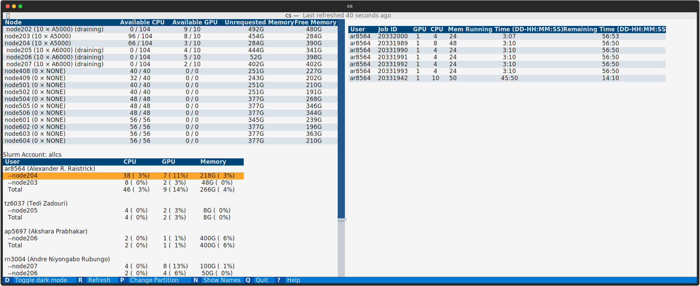

# Slurm Viewer

This is a command-line tool visualizing node usage in Princeton Ionic and Neuronic.
This is a CLI-replica of `clusterstat/realtime`

<picture>
  
</picture>


## Use

This app needs cursor input! Make sure your shell prompt and your terminal allows both. 
(all modern terminal allows cursor input though.)

### 1. Quick method

I have included binary in my personal folder. 
Add the following line at the end of your `~/.bashrc`

```bash
sv() {
    /n/fs/jc-project/slurmcmd/dist/slurmviewer
}
```

Restart the terminal, and type `sv`


### 2. Download Binary

You can also download binary from [Releases](https://github.com/a6o/Slurm-Viewer/releases).
It will probably have same file as above. 

### 3. Run using Python.

1. Clone this repository.
2. Install Textual, and run!
```
pip install textual
python ./app.py
```

### 4. Make binary

1. First install pyinstaller
```bash
pip install pyinstaller
```

2. Then, run following
```bash
pyinstaller ./app.py --onefile --add-data="./style.tcss:." --add-data="./info.txt:." --exclude-module numpy --exclude-module matplotlib --exclude-module jedi --hidden-import textual.widgets._markdown_viewer -n slurmviewer
```

3. run `./dist/slurmviewer`

## License
I claim no rights to this code. Do whatever you want with it. 
